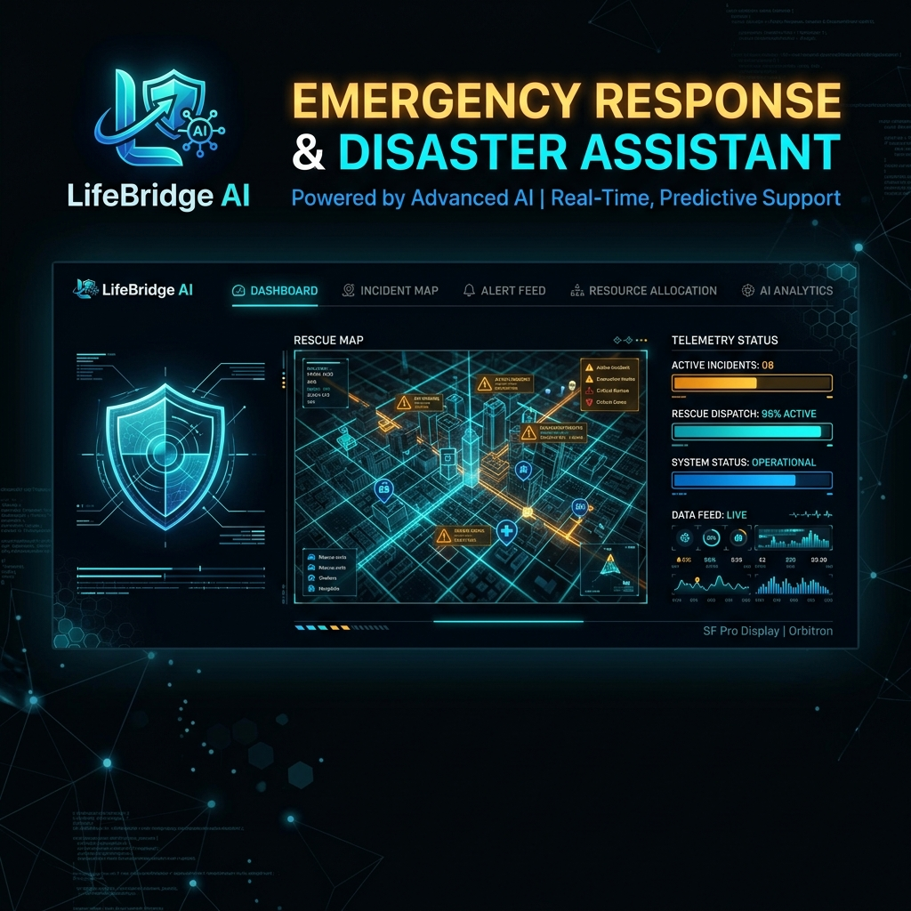
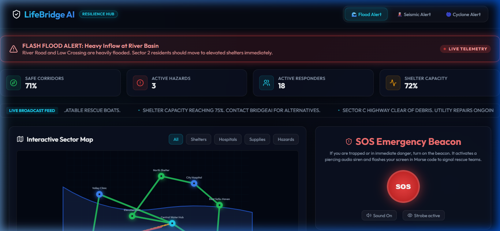
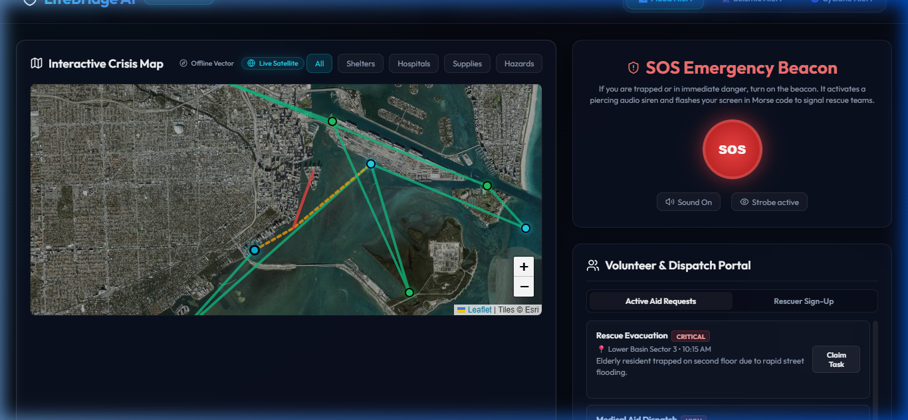
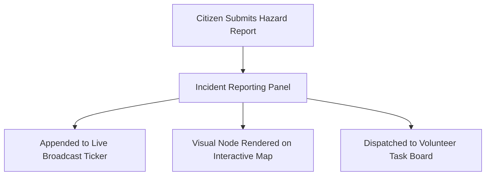
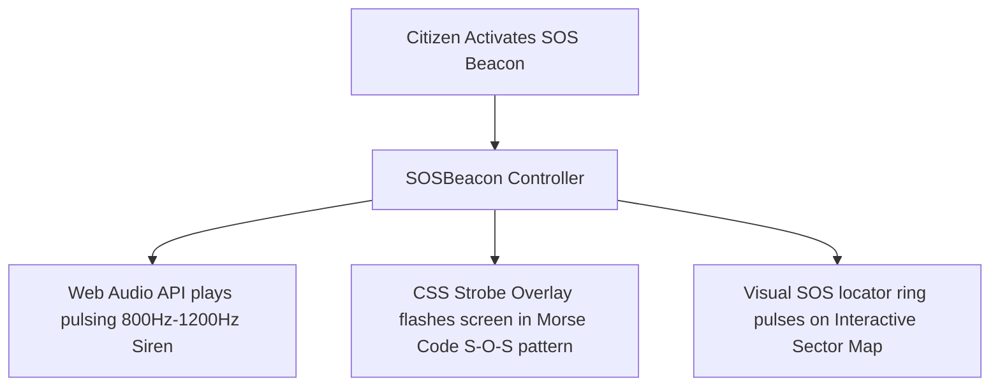
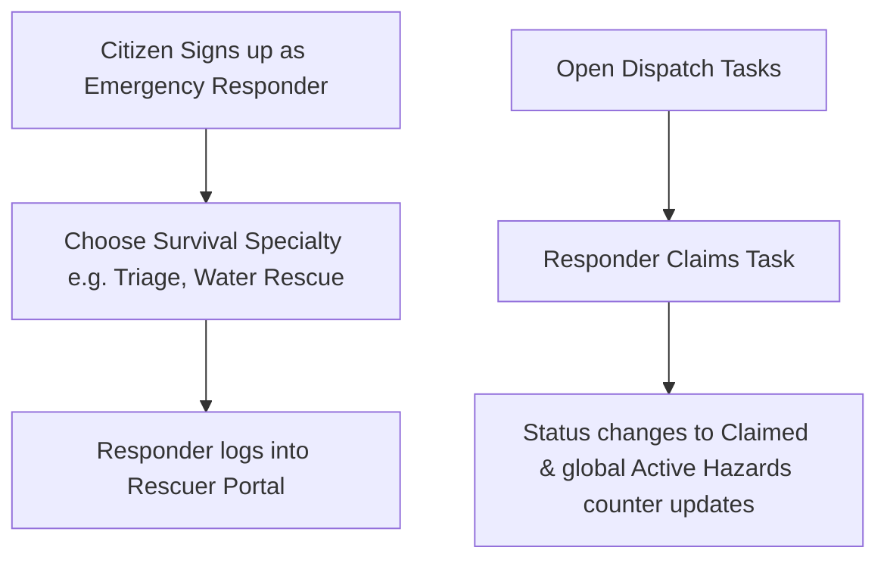

# LifeBridge AI - Emergency Response & Disaster Assistant



## 📸 Project Interface Demos

### 1. Offline Vector Grid Mode (Zero Network Resilience)


### 2. Live Satellite Geography Mode (Miami Sim Sector)


**LifeBridge AI** is a premium, real-time emergency response platform designed to bridge the gap between citizens in distress and rescue organizations during major natural disasters (floods, earthquakes, cyclones) and accidents.

Built as a responsive Single Page Application (SPA) using **React, Vite, and Vanilla CSS**, the platform incorporates advanced client-side telemetry simulation, interactive vector graphics routing, web audio emergency beacons, and automated response dispatching.

---

## ⚡ Key Features

*   **Dynamic Scenario Switcher:** Toggle between *River Valley Flash Flood*, *Metropolis Earthquake*, and *Coastal Cyclone Tasha*. The entire application—from interactive road segments and shelter details to metrics and checklist guides—updates dynamically based on the active disaster context.
*   **Interactive Sector Map:** An vector SVG-based map rendering live roads (flooded, blocked, or safe), hospital triage posts, and shelters. Click on any facility to view details and plot a glowing, animated "Safe Evacuation Route" from the citizen's location.
*   **SOS Distress Beacon:** Uses the browser's native **Web Audio API** to synthesize a pulsing, high-pitch rescue siren. Additionally, it launches a full-screen strobe overlay that flashes in an **SOS Morse Code pattern** (`S-O-S`: three short, three long, three short flashes) to serve as a visual signal in dark environments.
*   **Volunteer & Dispatch Matching Portal:** Citizens can sign up as emergency responders with specific skills (First Aid, Search & Rescue, offroad transport) and claim open rescue tasks posted by others.
*   **Real-time Hazard Reporting:** A quick broadcast panel allowing citizens to report rising water, collapsed structures, or road blockages, which immediately updates the map markers and live broadcast news ticker.
*   **Ration & Supplies Hub:** Tracks progress bars of critical materials (drinking water, blankets, medical kits) with modal forms to request aid or pledge donation drops.
*   **Interactive Survival Guide & Quiz:** Practical step-by-step checklist items for safety preparation combined with a gamified preparedness quiz to train citizens on emergency protocols.
*   **BridgeAI Conversational Agent:** A survival chatbot offering natural-language advice, safety routing instructions, and medical first-aid information.

---

## 🔄 System Workflows

The following diagrams illustrate the core workflows inside the LifeBridge AI platform:

### 1. Incident Broadcast Workflow


### 2. SOS Beacon & Signal Workflow


### 3. Volunteer Rescuer Dispatch Matching Workflow


---

## 🛠️ Installation & Setup

### Prerequisites
*   Node.js (v18 or higher)
*   npm (v9 or higher)

### Setup Steps
1.  **Clone the Repository:**
    ```bash
    git clone <your-repository-url>
    cd LifeBridge-AI
    ```

2.  **Install Dependencies:**
    ```bash
    npm install
    ```

3.  **Run Development Server:**
    ```bash
    npm run dev
    ```
    Once started, navigate to `http://localhost:5173/` in your browser.

4.  **Production Build:**
    ```bash
    npm run build
    ```
    Bundles the app for production in the `/dist` directory.

---

## 🎨 Theme & Styling System
The interface uses a custom **Obsidian Glassmorphism Theme** defined in `src/index.css`:
*   **Base Palette:** Deep Obsidian backgrounds (`#060913` to `#121824`) with glowing cyber-safety accents:
    *   `Emerald Green` for safe paths and open shelters.
    *   `Crimson Red` for active hazards and SOS distress signals.
    *   `Amber Yellow` for caution and critical warnings.
    *   `Cyan/Blue` for triage centers and AI logs.
*   **Interactivity:** Smooth micro-transitions, pulsing locator rings, and custom slide-in animations for all overlays.
